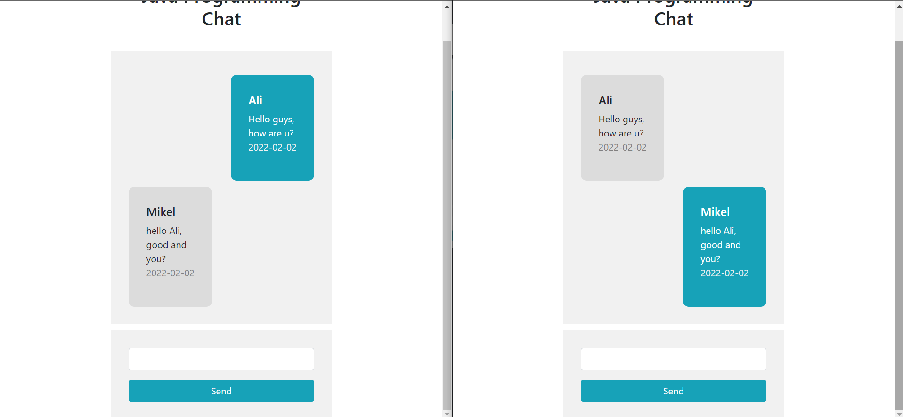

# RealtimeChat
 
This repository represents a realtime chat using django

## Screenshots

<div float="left">
    
    
    
</div>

## Functions

- Create a chat room
- Enter a chat room
    - via room name
- Enter your name
- send a message
- chat :)

## Clone the project

```
git clone git@github.com:alized559/RealtimeChat.git
cd RealtimeChat
```

## Edit Settings

### Configure database with xampp server

```
DATABASES = {
    'default': {
        'ENGINE': 'django.db.backends.mysql',
        'NAME': 'databasename',
        'USER': 'root',
        'PASSWORD': '',
        'HOST': '127.0.0.1',
        'PORT': '3306',
        'OPTIONS': {
            'init_command': "SET sql_mode='STRICT_TRANS_TABLES'"
        }
    }
}
```

## Apply to Database

```
python manage.py makemigrations
python manage.py migrate
```

## Running

```
python manage.py runserver
```